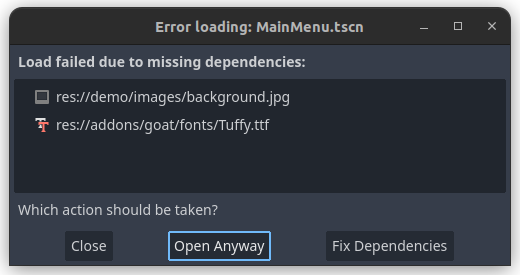

# Installation instructions

You can install GOAT by downloading it from the [Asset Library](https://godotengine.org/asset-library/asset/2108) (as a plugin).

Alternatively, you can clone this entire Godot project, which also includes a short demo game. When choosing this option, Godot might show an import warning message:

This message can be ignored by clicking "Open Anyway".

In both cases, the Godot project should be reloaded after installing GOAT (Project -> Quit to Project List -> open project again).
